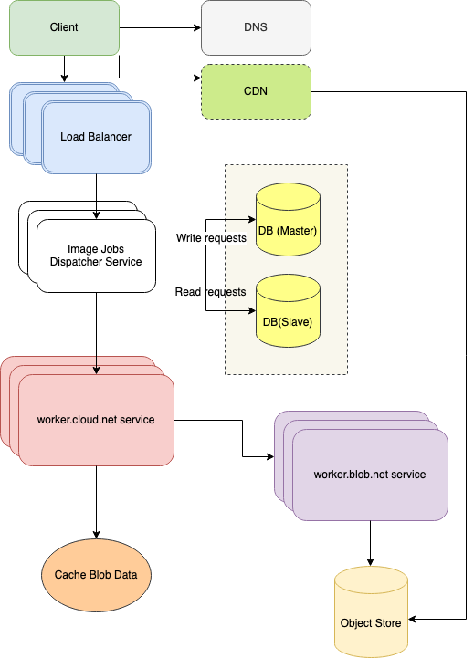

# image-jobs-dispatcher
PoC for solving problem

### DEPLOYMENT

1. Build image command `make imagever`
1. Define all necessary environment variables into docker-compose.yml.
    - WORKER_SERVICE_URL - URL to 'Worker Service API' (default value set up to stub)
    - BLOB_SERVICE_URL - URL to 'Blob Service API' (default value set up to stub)
1. Execute `make deploy`
1. In case un-deploying run command `make undeploy`

## System Design

### Diagram

See approximate system design on diagram below base on approximate
back-of-the-envelope calculations. The numbers came up just for example to adjust with architecture.

    Approximate calculations:
        - 10 million jobs per day
        - 300 million jobs per month
        - 1 billion read image per month
        - 3:1 read to write ratio
    Calculations:
        - Size per request: There was set up ~3Mb by default max body size
        - Size traffic per month: ~860TB content per month for write
        - SIze on read 3Mb per transaction * 1 billion read request per month
        2.8Pb per month ~33,6Pb Max object storage size annual

    Assumptions:
    10 submiting jobs p/s as avarage
    30 read requests p/s  as avarage
 

### Improvements for productions
1. Add more unit tests (in demo were added only minimum test that service are workable. Just demonstrate skills and PoC demo)
1. Do proper back-of-the-envelope calculations for detect KPI of service based on real requirements
1. Add performance tests following KPI
1.  In case to deploy to Kubennetes cluster create helm package 
        (following from task email for demo I went with docker-compose as the simpleset way)
1. Add supporting TLS for web server
1. Bring persistence store for image jobs dispatcher service for storing jobs info st
1. Adjust System Design by requirements (add/remove memory cache and DB replicas)
1. Following but pod container resources limits adjust http request processing parameters: 
   - body size
   - throttling (Throttle is a middleware that limits number of currently processed requests at a time across all users.)
   - limiter (Rate-limiter for requests)

### Assumptions in this PoC (keep is simple as possible for demo)
1. Not using CDN and Cache level
1. Instead of using DB for Image Jobs Dispatcher service save jobs to memmory
1. 'worker.blob.net' response static replies and only one MIME type 'image/png'
1. worker.cloud.net and worker.blob.net are AP (A - availability, P - partition tollerance) disctributed system 
        in terms of CAP teoreme and I presume that are available always
1. For minor network problems for request to worker.cloud.net and worker.blob.net were using only retry pattern following item 1
1. There are no unit tests for stubs

### Links
1. https://app.diagrams.net/ - was used for building Systme Design Diagram
2. Skeleton/templates of go project was used from exiting way in my own repo [Medregistry API v2.0](https://github.com/theshamuel/medregistry20).
        This project is in progress status.